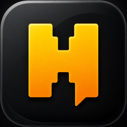
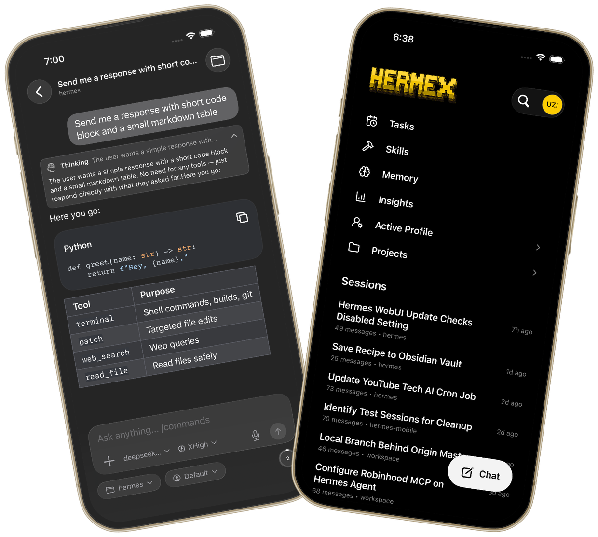
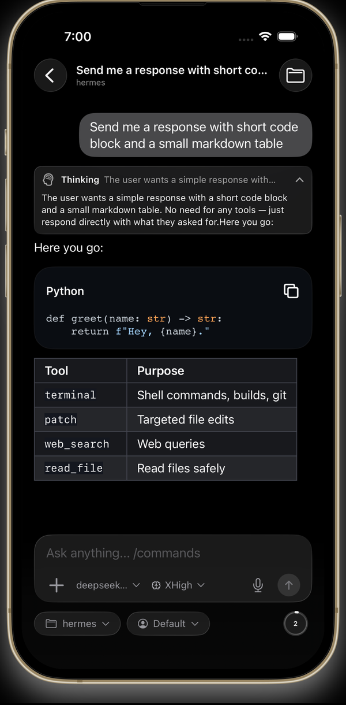
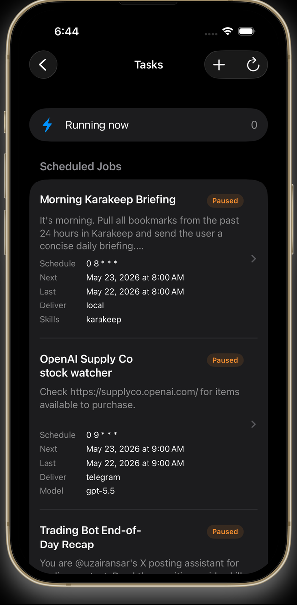
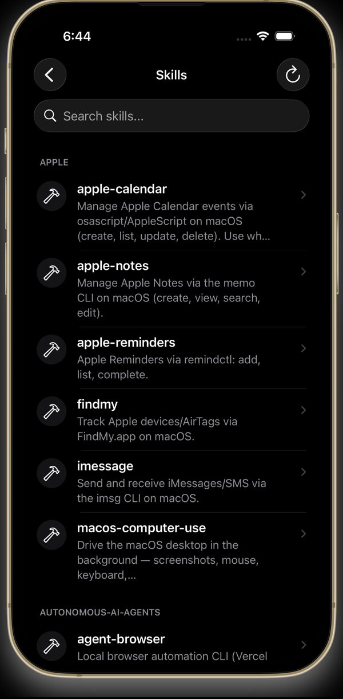

<div align="center">



# Hermex

**Control your self-hosted [Hermes](https://github.com/nesquena/hermes-webui) agent from your iPhone.**

Your server. Your iPhone. No middleman.

[](https://apps.apple.com/app/hermex/id6767006319)
[](https://swift.org)
[](LICENSE)
[](https://x.com/uzairansar)
[](https://buymeacoffee.com/callmeuzi)

<a href="https://apps.apple.com/app/hermex/id6767006319">
  
</a>

[Website](https://hermexapp.com) · [App Store](https://apps.apple.com/app/hermex/id6767006319) · [Report a bug](https://github.com/uzairansaruzi/hermex/issues) · [Contributing](CONTRIBUTING.md)



</div>

Hermex is a native SwiftUI iPhone app for driving a self-hosted [hermes-webui](https://github.com/nesquena/hermes-webui) server — a mobile cockpit for an AI agent that lives on a machine **you** control. The phone is the control plane, not the compute plane: the agent, its tools, and your data stay on your own hardware.

- **Free.** No subscriptions, no in-app purchases.
- **Private.** No analytics, no tracking, no third-party relay — the app talks only to your server.
- **Native.** Real SwiftUI, built for iOS 18+, not a web wrapper.

## Features

- **Chat with your agent** — send messages with model, reasoning-effort, workspace, and profile options; attach files and images; watch responses stream in real time with thinking and tool-call detail.
- **Steer or stop a run** mid-flight.
- **Sessions** — browse, search, and resume every conversation on your server; cached sessions stay readable offline.
- **Pick your models** — switch between any model or provider your server is configured for, with recents and favorites.
- **Profiles & projects** — switch agent profiles and organize sessions into projects.
- **Tasks** — view and edit your agent's scheduled cron jobs from your phone.
- **Skills** — browse and search the agent's installed skills.
- **Workspace browser** — explore your server's file system from the app.
- **Memory & Insights** — read-only panels for agent memory and usage analytics.

<div align="center">
<table>
  <tr>
    <td align="center"><br /><sub><b>Stream responses in real time</b></sub></td>
    <td align="center"><br /><sub><b>Manage scheduled tasks</b></sub></td>
    <td align="center"><br /><sub><b>Browse agent skills</b></sub></td>
  </tr>
</table>

More screenshots at [hermexapp.com](https://hermexapp.com).
</div>

## Getting started

Hermex is a client only — it does not ship with, host, or provision a backend. You bring your own [hermes-webui](https://github.com/nesquena/hermes-webui) server (a third-party, MIT-licensed open-source project) running on a machine you control. Setup takes about 15 minutes:

1. **Run the server.** Install and start `hermes-webui` on macOS, Linux, or Windows/WSL2 (Python 3.11+). Set `HERMES_WEBUI_PASSWORD`.
2. **Make it reachable from your phone** (see options below).
3. **Connect.** [Download Hermex](https://apps.apple.com/app/hermex/id6767006319), enter your server URL (e.g. `https://hermes.yourdomain.com`) and password, and you're in.

Self-hosting the server, securing it, and keeping it reachable are your responsibility.

### Making the server reachable

- **HTTPS via a tunnel or reverse proxy (recommended).** Expose the server through Cloudflare Tunnel or any reverse proxy that terminates real TLS at a hostname you own. Real HTTPS keeps iOS App Transport Security happy with no exceptions. On a publicly reachable hostname the password is your only app-level defense — set a strong one.
- **Private mesh network.** Run the server bound to all interfaces with a password, install either Tailscale or NetBird on both the server and iPhone, and connect to `http://<private-network-ip>:8787`. Confirm the mesh access policy and host firewall allow the iPhone to reach TCP port 8787. Plain HTTP is supported only for addresses in the app's scoped `100.64.0.0/10` range; use HTTPS for custom ranges or IPv6.
- **Simulator-only local testing** can use `http://localhost:8787` when the server runs on the same Mac.

### Troubleshooting the connection

If connection testing fails, check these first:

1. The machine hosting `hermes-webui` is awake.
2. `hermes-webui` is running and serving `/health` (`curl https://<your-server>/health`).
3. The tunnel, reverse proxy, or private mesh network is connected.
4. The server URL and password are correct.

## Building from source

Prefer the [App Store build](https://apps.apple.com/app/hermex/id6767006319) unless you're developing. To build yourself you need Xcode 26 or newer (iOS 18 SDK) and an iPhone or simulator on iOS 18+.

Clone the repo, open `HermesMobile.xcodeproj`, and run the `HermesMobile` scheme on an iPhone simulator (the Xcode target is `HermesMobile`; the app's display name is `Hermex`). Dependencies are resolved automatically via Swift Package Manager.

From the command line:

```zsh
xcodebuild -project HermesMobile.xcodeproj -scheme HermesMobile -destination 'platform=iOS Simulator,name=iPhone 17' build
```

```zsh
xcodebuild test -project HermesMobile.xcodeproj -scheme HermesMobile -destination 'platform=iOS Simulator,name=iPhone 17'
```

If that simulator is not installed, list available devices and choose a nearby iPhone simulator:

```zsh
xcrun simctl list devices available
```

Local validation defaults for XcodeBuildMCP users live in `.xcodebuildmcp/config.yaml`; the standard post-change flow is in [`DEVELOPMENT.md`](DEVELOPMENT.md).

## Server compatibility

The app is developed and tested against the `hermes-webui` commit pinned in [`UPSTREAM_TESTED_SHA`](UPSTREAM_TESTED_SHA). Upstream does not yet guarantee API stability (its README declares version skew unsupported pending their stable-API work), so newer or older server versions may break individual features — please include your server version in bug reports. The app decodes tolerantly (unknown fields never crash it) and endpoint shapes are verified against upstream source, never invented; see [`CONTRACT_TESTS.md`](CONTRACT_TESTS.md) for the contract-testing approach.

## Documentation map

- [`PROJECT_SPEC.md`](PROJECT_SPEC.md): source of truth for product scope, API behavior, dependencies, and architecture decisions.
- [`PROJECT_INTENT.md`](PROJECT_INTENT.md): short orientation; useful for product tradeoffs, not implementation details.
- [`DEVELOPMENT.md`](DEVELOPMENT.md): local development workflow, server setup notes, and the maintainer release runbook.
- [`TESTFLIGHT.md`](TESTFLIGHT.md): maintainer-only TestFlight/App Store Connect operations.
- [`CONTRACT_TESTS.md`](CONTRACT_TESTS.md): upstream contract-test readiness and the pin-advance policy.
- [`SECURITY.md`](SECURITY.md): how to report a vulnerability.
- [`docs/agents/`](docs/agents): repo-local agent workflow conventions (issues, triage labels, domain notes).
- [GitHub Issues](https://github.com/uzairansaruzi/hermex/issues): source of truth for active bugs, polish notes, and feature requests.

## Contributing

Contributions are welcome — see [`CONTRIBUTING.md`](CONTRIBUTING.md) for how to pick up work and open a PR, [`AGENTS.md`](AGENTS.md) for the working agreement coding agents follow in this repo, and the [Code of Conduct](CODE_OF_CONDUCT.md). The short version:

- Do not invent API endpoints or JSON shapes; verify against the upstream server source or a running server.
- Every `Codable` model decodes tolerantly — never crash on unknown fields.
- Add no third-party dependencies beyond the locked list in `PROJECT_SPEC.md` without explicit approval.
- Do not modify the upstream `hermes-webui` server from this repo.

## Support the project

Hermex is free and built in the open. If it's useful to you:

- ⭐ **Star this repo** — it helps others find the project.
- 🐦 **Follow [@uzairansar on X](https://x.com/uzairansar)** for updates and dev logs.
- ☕ **[Buy me a coffee](https://buymeacoffee.com/callmeuzi)** to support development.

<a href="https://buymeacoffee.com/callmeuzi"></a>

## License

MIT — see [LICENSE](LICENSE).

Hermex is an independent client and is not affiliated with the upstream [hermes-webui](https://github.com/nesquena/hermes-webui) project. Apple, the Apple logo, and App Store are trademarks of Apple Inc.
